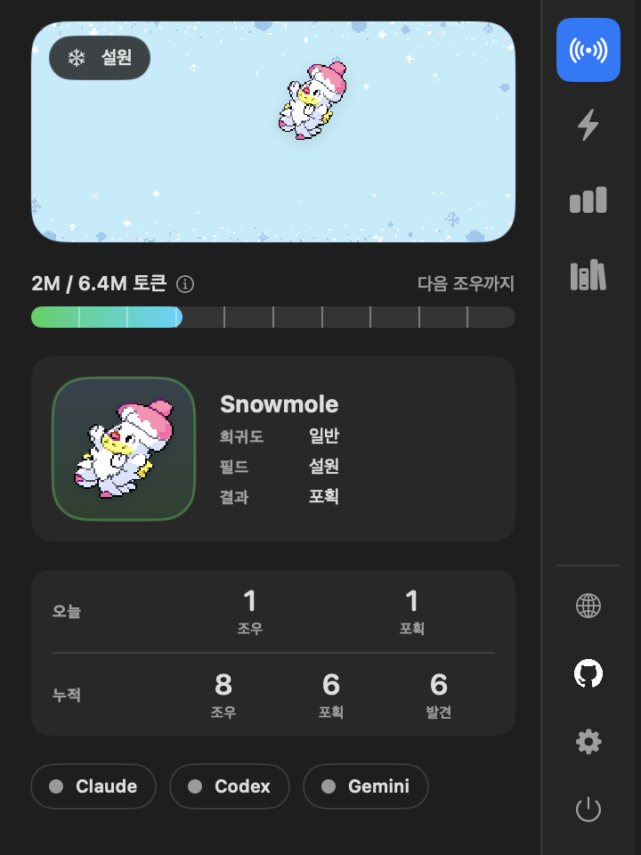
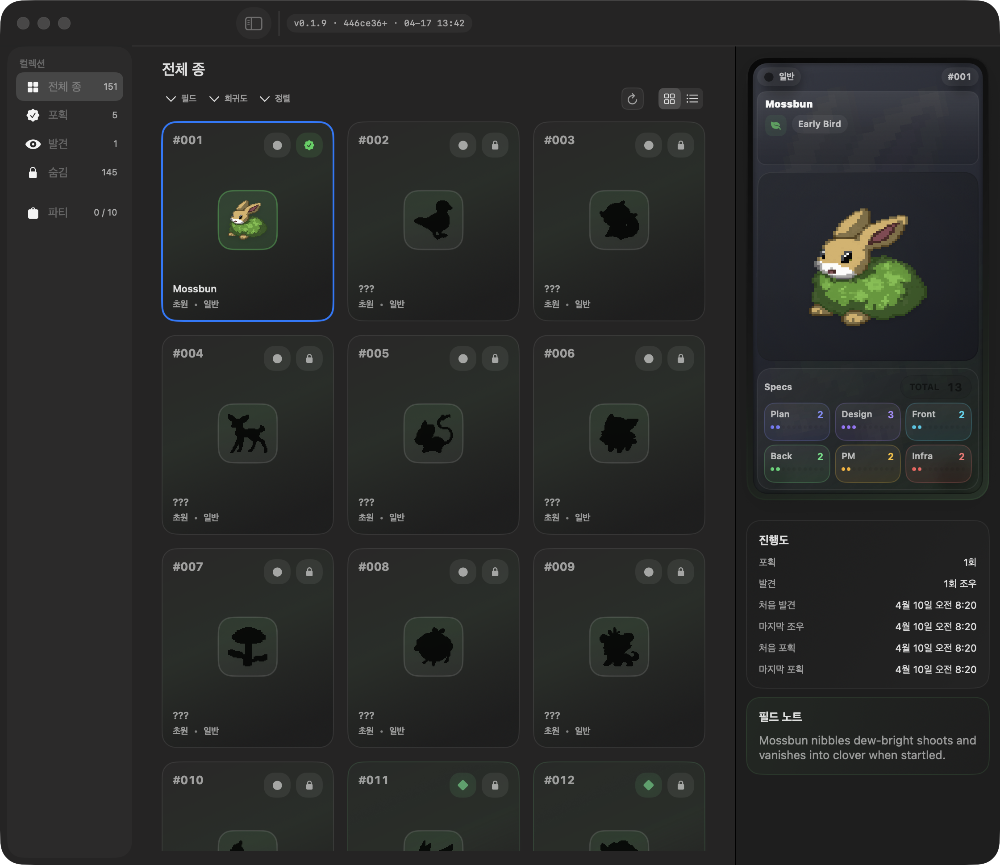
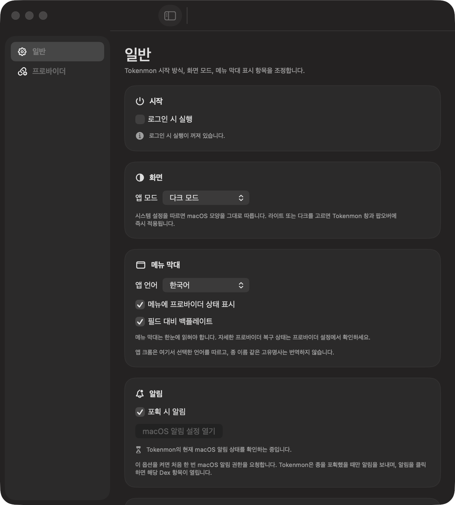

# Tokenmon

[한국어](README.ko.md) | [English](README.md)

평소처럼 AI 코딩하면, 메뉴 막대에서 Tokenmon이 조용히 모입니다.

Tokenmon은 Claude Code와 Codex 사용을 가볍고 귀여운 수집 경험으로
바꿔주는 macOS 메뉴 막대 앱입니다. 코딩하는 동안 탐험이 쌓이고, 가끔
새로운 Tokenmon을 만나며, 포획 결과와 Dex가 계정 없이 Mac 안에
차곡차곡 쌓입니다.


## 바로 써보기

- [최신 macOS 릴리즈 다운로드 (DMG)](https://github.com/aroido/tokenmon/releases/latest)
- Homebrew로 설치:

```bash
brew install --cask aroido/tokenmon/tokenmon
```

- macOS Sequoia 이상에서 설치할 수 있습니다

## 왜 계속 켜두게 되나

- 평소 하던 AI 코딩이 별도 조작 없이 작은 수집 경험으로 이어집니다.
- 메뉴 막대에 가볍게 머물러서 흐름을 끊지 않고도 상태를 한눈에 볼 수
  있습니다.
- 계정 없이, 오프라인에서도, 로컬 중심으로 돌아갑니다.
- 프롬프트나 응답 내용을 저장하지 않아도 게임플레이가 작동합니다.
- 릴리즈 빌드는 앱 안에서 업데이트를 받을 수 있어 부담 없이 계속 써볼 수
  있습니다.

## 스크린샷

<p align="center">
  
  
  
</p>

## 공개 소스 레포

- 이 저장소는 배포된 Tokenmon 스냅샷을 공개하는 source-available 미러입니다.
- GitHub Releases, Sparkle 업데이트, Homebrew 설치 기준은 이 저장소가
  맡습니다.
- 일상 개발, maintainer 워크플로, 내부 검수 산출물은 이 공개 미러 밖에서
  관리합니다.
- 이 저장소는 빌드 가능한 공개 스냅샷으로 보되, 일상 협업의 주 개발 레포로
  가정하지 않는 편이 좋습니다.

## 소스에서 직접 빌드

```bash
swift build
./scripts/ai-verify --mode pr
./scripts/build-release
```

## 문서

- [공개 소스 개요](docs/architecture/public-source-overview.md)
- [공개 문서 인덱스](docs/INDEX.md)

## 라이선스

Tokenmon 코드는 [FSL-1.1-ALv2](LICENSE.md)로 공개됩니다. 현재 버전은
OSI 기준 오픈소스는 아니며, 소스는 볼 수 있지만 경쟁 목적의 상업적 사용은
제한됩니다. 공개 후 2년이 지나면 해당 버전은 Apache 2.0으로 전환됩니다.

창작 자산은 [LICENSE-assets.md](LICENSE-assets.md)에서 별도로 다루고,
이름과 로고는 [TRADEMARKS.md](TRADEMARKS.md)의 적용을 받습니다.
